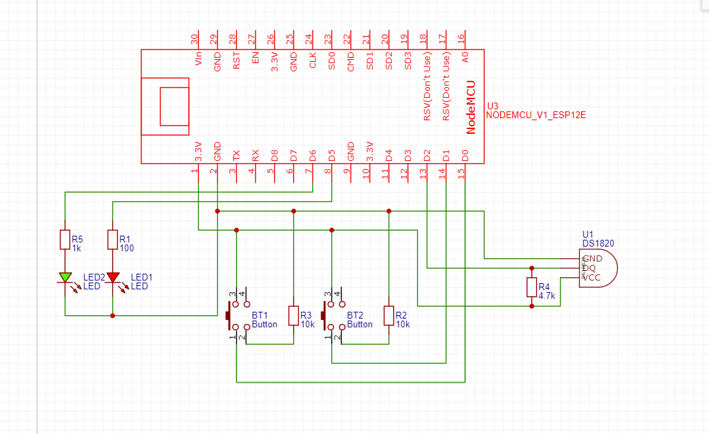
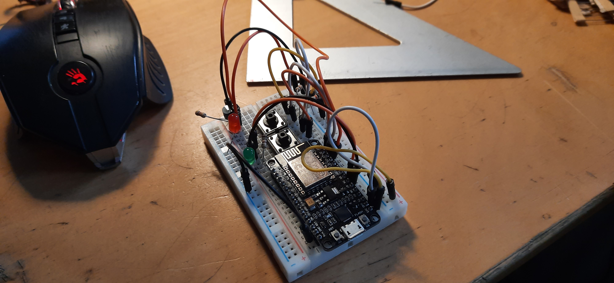
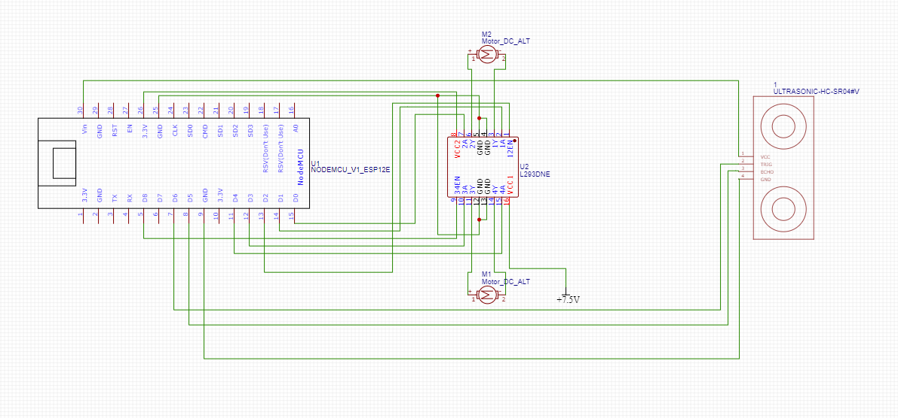
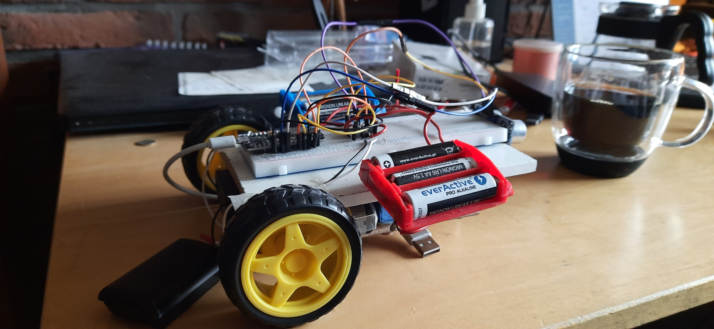

# Sprawozdanie z projektu zaliczeniowego Systemów Wbudowanych
Autorzy: Mikołaj Walkowski 145399, Bartosz Chazan 145338

## Cel projektu 
Stworzenie sieci do zarządzania klientami opartymi na płytce esp-12e z różnymi zasobami za pomocą centralnego serwera opartego na raspberry Pi 4b.  
Sieć ta ma na celu umożliwienie:
- zbierania danych z sensorów klientów
- sterowania klientami poprzez system prostych reguł
- przeglądu danych za pomocą strony http w lokalnej sieci.
- tworzenia i zarządzania regułami przez stronę http.
- zapisywanie danych o uruchomieniu urządzeń, odczycie sensorów jak i reguł w bazie danych.

### Implementacja

#### Reguły
Jako wzór prostej reguły w projekcie przyjęto:  
    Jeżeli ostatni odczyt (x) urządzenia A spełnia $f(x,const.)$, to ustaw stan urządzenia B na y, gdzie $f(a,b) \in \{ a=b;a\leq b;a\geq b;a < b ;a > b;a \neq b \}$

#### Protokół komunikacji
- Opis urządzenia  
    ```
    [k] identifier %json
    ```
    przykładowy JSON
    ```json
        {mac: "AA:AA:AA:AA:AA",
            devices: [
                {
                name: "sonar",
                type: "passive",
                units: "cm" 
                },
                {name: "motorR",
                type: "active",
                units: null
                },
                {name: "motorL",
                type: "active",
                units:null
                }]
        }
    ```
- Zmienienie stanu urządzenia  
    ```
    [s] %nazwa %bool
    ```
- Odczyt sensora 
    ```
    [k] %nazwa %number
    ```
- Sygnał puls klienta
    ```
    [k] _alive
    ```

#### Server
- baza danych
  - ```javascript
        (async () => {
        db = await open({
            filename: './db/sensors.db',
            driver: sqlite3.Database
        })
        //await db.exec('DROP TABLE devices');await db.exec('DROP TABLE devReadout');await db.exec('DROP TABLE rules');
        //db.exec('DROP TABLE devReadout');
        await db.exec('CREATE TABLE IF NOT EXISTS devices (espId, devName, devType, devUnits, CONSTRAINT pkDevices PRIMARY KEY(espId ,devName) ON CONFLICT IGNORE)');
        await db.exec('CREATE TABLE IF NOT EXISTS devReadout (espId ,devName, readOut REAL, date datetime DEFAULT current_timestamp, CONSTRAINT fkDevR__Dev FOREIGN KEY(espId, devName) REFERENCES devices(espId, devName) ON DELETE CASCADE )');
        await db.exec('CREATE TABLE IF NOT EXISTS rules (ruleName, ruleTargetId, ruleTargetName, ruleSourceId, ruleSourceName, ruleFunction, val REAL,result NUMBER, CONSTRAINT pkRules PRIMARY KEY(ruleName) ON CONFLICT IGNORE,  CONSTRAINT fkDevRT_Dev FOREIGN KEY(ruleSourceId, ruleSourceName) REFERENCES devices(espId, devName) ON DELETE CASCADE,  CONSTRAINT fkDevRS_Dev FOREIGN KEY(ruleTargetId, ruleTargetName) REFERENCES devices(espId, devName) ON DELETE CASCADE)');
    })()
    ```
  - Baza danych składa się z trzech tabel:
    1. devices - zawiera pary urządzenie i adres mac każdego obsługiwanego klienta, a także dodatkowe informacje o każdym urządzeniu.
    2. devRedout - zawiera klucz główny tabeli devices, odczyt i godzinę zapisania.
    3. rules - zawiera zdefiniowane przez użytkownika reguły.
  - Do przechowywania danych wykorzystano interface SQLite3.
- komunikacja z serwerem
    1. Po nawiązaniu połączenia klient wysyła swój opis.
    2. Klient wysyła co określony interwał lub zmianę stanu odczyty ze swoich sensorów.
    3. Serwer po otrzymaniu wiadomości zapisuje odczyt do bazy danych.
    4. Serwer sprawdza czy w bazie danych istnieją reguły bazujące na odczycie z danego sensora. 
       1. Jeżeli istnieją to do każdego urządzenia będącego celem reguł zostaje wysłana wiadomość z poleceniem zmiany stanu na zgody z daną regułą. 
       2. Zostaje zapisana także zmiana stanu urządzenia do bazy danych.
- Strona http
    Serwer http został napisany przy użyciu ExpressJS, ExpressHandlebars.
    Przy pisaniu strony wykorzystano ChartJS, Bootstrap, chartjs-adapter-date-fns.
    #TODO Screeny strony 
- Serwer został postawiony na raspberryPi 4b.
  
#### Klient
- kod klienta #TODO Może jednak nie cały kod
    ```arduino
        #include <ESP8266WiFi.h>
        #include <Arduino.h>
        #include <DallasTemperature.h>
        #include <OneWire.h>

        #ifndef STASSID
        #define STASSID "OGMv2"
        #define STAPSK  "amenoera"
        #endif
        // inicjalizacja 
        //first dev
        #define SENSORS_SIZE 1
        #define ACTIVE_SIZE 2
        #define TOGGLES_SIZE 0
        String introductionJson = "identifier {\"mac\":\""+ String(WiFi.macAddress()) +"\",\"devices\":[{\"name\":\"sonar\",\"type\":\"passive\",\"units\":\"cm\"},{\"name\":\"motorR\",\"type\":\"active\",\"units\":null},{\"name\":\"motorL\",\"type\":\"active\",\"units\":null}]}";

        // //second dev
        // #define SENSORS_SIZE 1
        // #define ACTIVE_SIZE 2
        // #define TOGGLES_SIZE 2
        // OneWire oneWire(D2); 
        // DallasTemperature temp(&oneWire);
        // String introductionJson = "identifier {\"mac\":\""+ String(WiFi.macAddress()) +"\",\"devices\":[{\"name\":\"temperatureSensor\",\"type\":\"passive\",\"units\":\"C\"},{\"name\":\"buttonL\",\"type\":\"passive\",\"units\":\"pressed\"},{\"name\":\"buttonR\",\"type\":\"passive\",\"units\":\"pressed\"},{\"name\":\"LedRed\",\"type\":\"active\",\"units\":null},{\"name\":\"LedGreen\",\"type\":\"active\",\"units\":null}]}";

        const char* ssid     = STASSID;
        const char* password = STAPSK;

        const char* host = "ip addr";
        const uint16_t port = 3000;

        WiFiClient client;

        char buff[100];

        struct sensor
        {
        String name;
        float (*func)();
        unsigned long last;
        unsigned long interval;
        
        };

        struct toggle
        {
        String name;
        int pin;  
        int state;
        };

        struct active{
        String name;
        int state;
        int* pins; 
        void (*func)(struct active*,int);
        };

        struct sensor sensors[SENSORS_SIZE];
        struct active actives[ACTIVE_SIZE];
        struct toggle toggles[TOGGLES_SIZE];

        float getReadOut(String name){
        for(int i =0; i < SENSORS_SIZE; ++i){
            if(name == sensors[i].name){
            return sensors[i].func();;
            }
        }
        return 0;
        }

        void analyseMsg(){
        for(int i =0; i < ACTIVE_SIZE; ++i){
            if(String(buff).startsWith(actives[i].name)){
            Serial.println(actives[i].name);
            Serial.println(*(buff+actives[i].name.length()+1));
            if (*(buff+actives[i].name.length()+1) == '0'){
                actives[i].func(actives+i,0);
            }else{
                actives[i].func(actives+i,1);
            }
            return;
            }
        }
        }

        void connect(){
        Serial.print("(Re)Connecting\n");
        while (!client.connect(host, port)) {
            Serial.print(".");
            delay(1000);
        }
        Serial.println("\nSuccess\n");
        }

        float sonarfunc(){
        digitalWrite(D6, LOW);
        delayMicroseconds(2);
        digitalWrite(D6, HIGH);
        delayMicroseconds(10);
        digitalWrite(D6, LOW);
        return (pulseIn(D5,HIGH)*0.034)/2;
        }

        void motorfunc(struct active *motor, int state){
        if(motor->state != state){
            if(motor->state == 0){
            digitalWrite(motor->pins[0],HIGH);
            digitalWrite(motor->pins[1],HIGH);
            digitalWrite(motor->pins[2],LOW);
            motor->state = 1;
            }else{
            digitalWrite(motor->pins[0],HIGH);
            digitalWrite(motor->pins[1],LOW);
            digitalWrite(motor->pins[2],LOW);
            motor->state = 0;
            }
        }
        }

        void ledfunc(struct active *led, int state){
        if(led->state != state){
            if(led->state == 0){
            digitalWrite(*(led->pins),HIGH);
            led->state = 1;
            }else{
            digitalWrite(*(led->pins),LOW);
            led->state = 0;
            }
        }
        }

        void initDev1(){
        sensors[0].name = "sonar";
        sensors[0].last = millis();
        sensors[0].interval = 500UL;
        sensors[0].func = sonarfunc;

        pinMode(D6,OUTPUT);//trig
        pinMode(D5,INPUT);//echo
        digitalWrite(D6,LOW);

        actives[0].name = "motorR";
        actives[0].state = 1;
        int * pins1 = new int[3];
        int pin1[] ={D2,D0,D1};
        memcpy(pins1,pin1,sizeof(pin1));
        actives[0].pins = pins1;
        actives[0].func = motorfunc;

        pinMode(D2,OUTPUT);
        pinMode(D0,OUTPUT);
        pinMode(D1,OUTPUT);

        actives[0].func(actives,0);

        actives[1].name = "motorL";
        actives[1].state = 1;
        int * pins2 = new int[3];
        int pin2[] = {D8,D3,D4};
        memcpy(pins2,pin2,sizeof(pin2));
        actives[1].pins = pins2;
        actives[1].func = motorfunc;

        pinMode(D8,OUTPUT);
        pinMode(D3,OUTPUT);
        pinMode(D4,OUTPUT);

        actives[1].func(actives+1,0);
        }

        // Sec Dev
        // float tempfunc(){
        //   temp.requestTemperatures();
        //   return temp.getTempCByIndex(0);
        // }
        // void initDev2(){
        //   sensors[0].name = "temperatureSensor";
        //   sensors[0].func = tempfunc;
        //   sensors[0].last = millis();
        //   sensors[0].interval = 5000UL;

        //   pinMode(D1, INPUT);
        //   toggles[0].name = "buttonL";
        //   toggles[0].state = 0;
        //   toggles[0].pin = D1;
        //   pinMode(D0, INPUT);
        //   toggles[1].name = "buttonR";
        //   toggles[1].state = 0;
        //   toggles[1].pin = D0;

        //   pinMode(D5, OUTPUT); 
        //   actives[0].name = "LedRed";
        //   actives[0].state = 0;
        //   int * pin = new int;
        //   *pin = D5;
        //   actives[0].pins = pin;
        //   actives[0].func = ledfunc;
        //   ledfunc(actives  , 0);

        //   pinMode(D6, OUTPUT);
        //   actives[1].name = "LedGreen";
        //   actives[1].state = 0;
        //   int * pin2 = new int;
        //   *pin2 = D6;
        //   actives[1].pins = pin2;
        //   actives[1].func = ledfunc;
        //   ledfunc(actives +1 , 0);
        //  }

        unsigned long heartbeat, pulse = 1500UL;

        void setup() {
        Serial.begin(115200);

        Serial.println();
        Serial.println();
        Serial.print("Connecting to ");
        Serial.println(ssid);

        WiFi.mode(WIFI_STA);
        WiFi.begin(ssid, password);

        while (WiFi.status() != WL_CONNECTED) {
            delay(500);
            Serial.print(".");
        }

        Serial.println("");
        Serial.println("WiFi connected");
        Serial.println("IP address: ");

        Serial.print("connecting to ");
        Serial.print(host);
        Serial.print(':');
        Serial.println(port);

        Serial.println(WiFi.localIP());
        connect();
        client.write(introductionJson.c_str(),introductionJson.length()+1);
        heartbeat = millis();
        initDev1();
        // initDev2();
        }

        void loop() {
        if(!client.connected()){
            connect();
            client.write(introductionJson.c_str(),introductionJson.length()+1);
            for(int i = 0; i <SENSORS_SIZE;++i){
            sensors[i].last = millis();
            }
        }
        if(client.available()) {
            memset(buff,0, sizeof(buff));
            for(int i = 0; i< 100&&client.available(); ++i) {
            buff[i] = client.read();
            if(buff[i] =='\0') break;
            }
            Serial.print(buff);
            Serial.print('\n');
            for (int i = 0;buff[i] != '\0'; ++i)
            {
            Serial.print(buff[i],DEC);
            Serial.print(' ');
            }
            Serial.print('\n');
            analyseMsg();
        }
        //Checking if should send sensor update
        for(int i =0; i < SENSORS_SIZE ; ++i){
            if(sensors[i].last + sensors[i].interval < millis()){
            float readout = getReadOut(sensors[i].name);
            String msg = sensors[i].name + " " +  String(readout); 
            if(client.connected()){
                client.write(msg.c_str(),msg.length()+1);
            }else return;
            sensors[i].last = millis();
            }
        }
        //Checking if should send toggles update
        for(int i =0; i < TOGGLES_SIZE ; ++i){
            int curr = digitalRead(toggles[i].pin);
            if(curr!=toggles[i].state){
            toggles[i].state = curr;
            String msg = toggles[i].name + " " +String(curr);
            if(client.connected()){
                client.write(msg.c_str(),msg.length()+1);
            }else return;
            sensors[i].last = millis();
            }
        }
        if(heartbeat + pulse < millis()){
            client.write("_alive",7);
            heartbeat = millis();
        }
        }

    ```
- hardware 
  - Klient "pilot"
    - Schemat  
        
    - Zdjęcie  
        
  - Klient "robot" 
    - Schemat  
        
    - Zdjęcie   
        