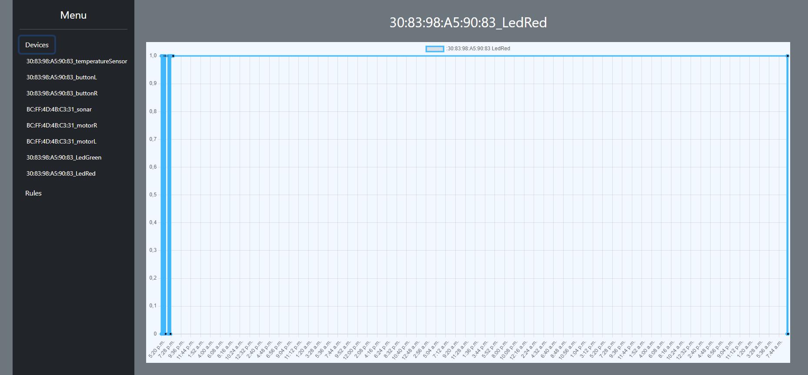

# Sprawozdanie z projektu zaliczeniowego Systemów Wbudowanych
Autorzy: Mikołaj Walkowski 145399, Bartosz Chazan 145338

## Cel projektu 
Stworzenie sieci do zarządzania klientami opartymi na płytce esp-12e z różnymi zasobami za pomocą centralnego serwera opartego na raspberry Pi 4b.  
Sieć ta ma na celu umożliwienie:
- zbierania danych z sensorów klientów
- sterowania klientami poprzez system prostych reguł
- przeglądu danych za pomocą strony http w lokalnej sieci.
- tworzenia i zarządzania regułami przez stronę http.
- zapisywanie danych o uruchomieniu urządzeń, odczycie sensorów jak i reguł w bazie danych.

### Implementacja
Kod źródłowy serwera, stron i klienta został umieszczony na platformie [github](https://github.com/mikolaj-walkowski/SW_2021) w folderach "firstNode" - serwer + strona, Swclient - klient. 
#### Reguły
Jako wzór prostej reguły w projekcie przyjęto:  
    Jeżeli ostatni odczyt (x) urządzenia A spełnia $f(x,const.)$, to ustaw stan urządzenia B na y, gdzie $f(a,b) \in \{ a=b;a\leq b;a\geq b;a < b ;a > b;a \neq b \}$

#### Protokół komunikacji
- Opis urządzenia  
    ```
    [k] identifier %json
    ```
    przykładowy JSON
    ```json
        {mac: "AA:AA:AA:AA:AA",
            devices: [
                {
                name: "sonar",
                type: "passive",
                units: "cm" 
                },
                {name: "motorR",
                type: "active",
                units: null
                },
                {name: "motorL",
                type: "active",
                units:null
                }]
        }
    ```
- Zmienienie stanu urządzenia  
    ```
    [s] %nazwa %bool
    ```
- Odczyt sensora 
    ```
    [k] %nazwa %number
    ```
- Sygnał puls klienta
    ```
    [k] _alive
    ```

#### Server
- Serwer został zaimplementowany w języku JavaScript
- baza danych
  - ```javascript
        (async () => {
        db = await open({
            filename: './db/sensors.db',
            driver: sqlite3.Database
        })
        //await db.exec('DROP TABLE devices');await db.exec('DROP TABLE devReadout');await db.exec('DROP TABLE rules');
        //db.exec('DROP TABLE devReadout');
        await db.exec('CREATE TABLE IF NOT EXISTS devices (espId, devName, devType, devUnits, CONSTRAINT pkDevices PRIMARY KEY(espId ,devName) ON CONFLICT IGNORE)');
        await db.exec('CREATE TABLE IF NOT EXISTS devReadout (espId ,devName, readOut REAL, date datetime DEFAULT current_timestamp, CONSTRAINT fkDevR__Dev FOREIGN KEY(espId, devName) REFERENCES devices(espId, devName) ON DELETE CASCADE )');
        await db.exec('CREATE TABLE IF NOT EXISTS rules (ruleName, ruleTargetId, ruleTargetName, ruleSourceId, ruleSourceName, ruleFunction, val REAL,result NUMBER, CONSTRAINT pkRules PRIMARY KEY(ruleName) ON CONFLICT IGNORE,  CONSTRAINT fkDevRT_Dev FOREIGN KEY(ruleSourceId, ruleSourceName) REFERENCES devices(espId, devName) ON DELETE CASCADE,  CONSTRAINT fkDevRS_Dev FOREIGN KEY(ruleTargetId, ruleTargetName) REFERENCES devices(espId, devName) ON DELETE CASCADE)');
    })()
    ```
  - Baza danych składa się z trzech tabel:
    1. devices - zawiera pary urządzenie i adres mac każdego obsługiwanego klienta, a także dodatkowe informacje o każdym urządzeniu.
    2. devRedout - zawiera klucz główny tabeli devices, odczyt i godzinę zapisania.
    3. rules - zawiera zdefiniowane przez użytkownika reguły.
  - Do przechowywania danych wykorzystano interface SQLite3.
- komunikacja z serwerem
    1. Po nawiązaniu połączenia klient wysyła swój opis.
    2. Klient wysyła co określony interwał lub zmianę stanu odczyty ze swoich sensorów.
    3. Serwer po otrzymaniu wiadomości zapisuje odczyt do bazy danych.
    4. Serwer sprawdza czy w bazie danych istnieją reguły bazujące na odczycie z danego sensora. 
       1. Jeżeli istnieją to do każdego urządzenia będącego celem reguł zostaje wysłana wiadomość z poleceniem zmiany stanu na zgody z daną regułą. 
       2. Zostaje zapisana także zmiana stanu urządzenia do bazy danych.
- Strona http
    Serwer http został napisany przy użyciu paczek ExpressJS, ExpressHandlebars.
    Przy pisaniu strony wykorzystano paczki ChartJS, Bootstrap, chartjs-adapter-date-fns.
    - Końcowy rezultat:  
        
        
        
        
- Serwer został postawiony na raspberryPi 4b.
  
#### Klient
- software:
  - Zaimplementowano w języku arduino.
  - Kod klienta jest nieblokujący. Napisano go z myślą o łatwym dostosowaniu się do różnych hardware'owych możliwości klienta. Wystarczy podać ilości podłączonych urządzeń danych typów, zainicjalizować je i podać ich funkcje sterujące.
- hardware 
  - Klient "pilot"
    - Schemat  
        
    - Zdjęcie  
        
  - Klient "robot" 
    - Schemat  
        
    - Zdjęcie   
        